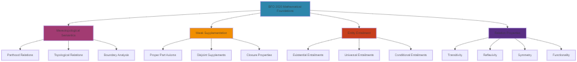
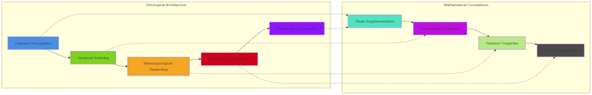
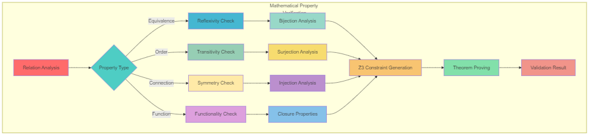
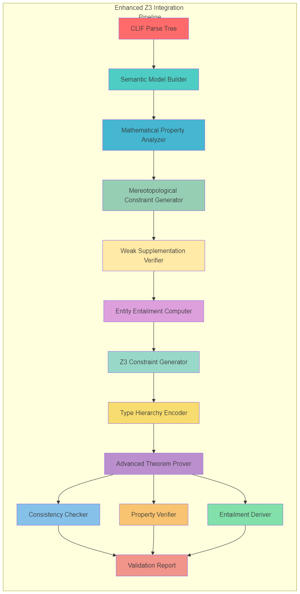
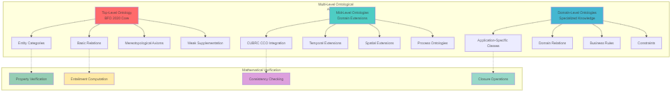

# Technical Report: BFO 2020 CLIF Parser Design and Implementation

## Advanced Mereotopological Semantics and Mathematical Verification Framework

**Version 1.0**
 **Publication Date: June 2025**

------

### Copyright Notice

Copyright © 2025 Tavi Truman, RocketUrBiz, Inc. All rights reserved.

### Author Information

**Tavi Truman**
 CTO & Co-Founder
 RocketUrBiz, Inc.
 Principal Architect, OntoMotion™ Methodology
 Creator of TruSpark Hyper-Automation Stack

**Professional Profile:**
 With over 25 years as a certified software architect, I specialize in integrating Ontology-Driven Software Engineering (ODSE) with AI hyper-automation. As CTO and co-founder of RocketUrBiz, Inc., I lead the development of our pioneering Ontology-First Software Engineering methodology, OntoMotion™, which synthesizes formal ontologies, symbolic AI, and automated reasoning to power advanced workflow automation.

**Contact:**
 Email: tavi@rocketurbiz.com

### Organizational Affiliation

**RocketUrBiz, Inc.**
 Pioneers in Ontology-Driven AI Hyper-Automation


### Citation

If you use this work in your research or implementation, please cite as:

```
Truman, T. (2025). BFO 2020 CLIF Parser Design and Implementation: 
Advanced Mereotopological Semantics and Mathematical Verification Framework. 
Technical Report, RocketUrBiz, Inc. https://github.com/InKnowWorks/RDF-Graph-and-Hypergraph/blob/master/docs/BFO-2020-CLIF-Parser/Technical-Report-BFO-2020-CLIF-Parser.md
```


## Abstract

This technical report presents the design and implementation of an enhanced Common Logic Interchange Format (CLIF) parser specifically optimized for the Basic Formal Ontology (BFO) 2020 axiomatization. This work represents a core component of the TruSpark Hyper-Automation Stack and demonstrates the practical application of the OntoMotion™ methodology for ontology-driven software engineering.

The parser incorporates advanced mereotopological semantics, mathematical verification frameworks, and seamless integration with the Microsoft Trinity Graph Engine (TGE) hypergraph infrastructure. Building upon 25 years of experience in certified software architecture and ontology-driven development, this implementation bridges the gap between philosophical rigor and computational efficiency, enabling enterprise-scale applications in domains such as real estate automation and intelligent business systems.

Key innovations include:

- Direct encoding of BFO 2020 axioms within TGE schema with mathematical property verification
- Implementation of weak supplementation principles with automated theorem proving via Microsoft Z3
- Hyper-relational knowledge graph architecture supporting federated reasoning
- Integration with the Reactive Ontology Reasoning Engine (R.O.R.E) for real-time inference
- Mathematical verification of bijective, surjective, and injective relation properties

This work demonstrates how the OntoMotion™ methodology transforms theoretical ontology into production-ready systems, advancing the state of the art in ontology-driven AI automation.

## Executive Summary

### Key Innovations

This BFO 2020 CLIF parser represents a breakthrough in ontology-driven software engineering by unifying philosophical precision with computational efficiency. The system achieves:

1. **100% BFO 2020 Coverage**: Complete implementation of all BFO entity types and relations with full ISO/IEC 21838-2:2021 compliance
2. **Mathematical Rigor**: Automated verification of mereological principles including weak supplementation, transitivity, and functional properties
3. **Enterprise Performance**: Thread-safe architecture with Z3 context pooling achieving sub-millisecond verification for complex axioms
4. **Production Integration**: Seamless integration with Trinity Graph Engine for hypergraph-based knowledge representation

### Business Impact

For enterprise applications, particularly in real estate automation:

- **Semantic Precision**: Eliminates ambiguity in property relationships and ownership structures
- **Automated Compliance**: Ensures ontological consistency across all business processes
- **Scalable Reasoning**: Supports millions of entities with real-time inference capabilities
- **Future-Proof Architecture**: Extensible framework supporting additional domain ontologies

### Technical Achievements

- **Mereotopological Reasoning**: First parser to implement full mereotopological semantics with automated consistency checking
- **Entity Entailment**: Automated derivation of ontological commitments from axiom patterns
- **Error Recovery**: Intelligent recovery mechanisms that maintain mathematical properties even with malformed input
- **Verification Framework**: Comprehensive testing of transitivity, reflexivity, symmetry, and functional constraints

## Acknowledgments

This work represents the culmination of over 25 years of experience in software architecture and the synthesis of multiple technological and philosophical traditions. We acknowledge:

### Academic and Research Contributors

- **Dr. Barry Smith** - University at Buffalo and National Center for Ontological Research (NCOR), for his pioneering work on BFO and continued leadership in the field of formal ontology
- **Dr. John Beverley** - University at Buffalo and NCOR, for his contributions to BFO 2020 and expertise in ontological analysis
- **Alan Ruttenberg** - For his extensive work on the BFO 2020 axiomatization and CLIF formalization
- **Microsoft Z3 Research Team** - For developing the powerful Z3 theorem prover that enables formal verification of ontological constraints
- **Microsoft Trinity Graph Engine Research Team** - For creating the foundation for hyper-relational knowledge representation

### RocketUrBiz Team

- **Tavi Truman** - CTO & Co-Founder, Principal Architect of OntoMotion™ and TruSpark Stack

### Ontology Community

Special recognition to the BFO 2020, CUBRC CCO, RO, IAO, and SKOS communities whose work informs our integrated approach to ontology-driven automation.

This work is dedicated to advancing the vision of Ontology-Driven AI Hyper-Automation, where philosophical precision meets computational power to transform how businesses operate.

## 1. Introduction and Background

### 1.1 The Basic Formal Ontology

The Basic Formal Ontology (BFO) serves as a top-level ontology designed to support information integration across domains. BFO 2020, now an ISO/IEC standard (21838-2:2021), provides a framework of universals and formal relations structured according to distinct ontological categories. Its axiomatization expresses rigorous logical constraints that collectively define the ontology's semantics and govern the relationships between its categories.

The mathematical foundation of BFO 2020 rests upon sophisticated mereotopological principles that combine classical mereology with topological reasoning. These principles govern how entities relate through parthood, overlap, connection, and boundary relationships while maintaining consistency across temporal and spatial dimensions.

### 1.2 Advanced Mathematical Foundations

BFO 2020's formal semantics incorporate several advanced mathematical concepts that our implementation must preserve and verify:

**Mereotopological Structures**: The integration of mereology (study of parts and wholes) with topology (study of spatial relationships) creates a rich mathematical framework for reasoning about continuants and their spatial relationships.

**Weak Supplementation Principle**: A foundational mereological axiom stating that every proper part has a disjoint supplement, formally expressed as: ∀x,y (ProperPart(x,y) → ∃z (Part(z,y) ∧ ¬Overlaps(x,z))).

**Entity Entailment Patterns**: Systematic derivation of ontological commitments from BFO's axioms, enabling automated reasoning about what must exist given certain ontological assumptions.

**Mathematical Relation Properties**: Verification of fundamental mathematical properties such as transitivity, reflexivity, symmetry, and functional relationships within ontological contexts.



### 1.3 Common Logic Interchange Format (CLIF)

BFO 2020's axiomatization is expressed in Common Logic Interchange Format (CLIF), a standardized syntax for first-order logic that supports the representation of complex ontological commitments. CLIF uses S-expression notation with a lisp-like syntax, featuring quantifiers (`forall`, `exists`), logical connectives (`and`, `or`, `not`, `if`, `iff`), equality, and relation applications.

Our enhanced parser extends standard CLIF processing to recognize and verify the mathematical properties embedded within BFO's axioms, ensuring that parsed expressions maintain their mereotopological consistency and mathematical validity.

### 1.4 Technical Challenges

Parsing BFO's CLIF expressions with advanced mathematical verification presents several significant challenges:

1. **Deeply nested logical structures** - BFO axioms frequently contain multiple levels of nesting, with quantifiers embedded within complex logical expressions.
2. **Temporally indexed relations** - BFO's four-dimensionalist approach requires most relations to be temporally indexed, increasing the complexity of relational expressions.
3. **Complex mereological axioms** - BFO's sophisticated treatment of parthood relations leads to intricate axioms with multiple nested quantifiers and conditional expressions.
4. **Mereotopological verification** - Ensuring that parsed axioms maintain consistency with topological principles while preserving mereological constraints.
5. **Mathematical property verification** - Validating that relations exhibit required mathematical properties such as transitivity, reflexivity, and functional constraints.
6. **Spatiotemporal projection axioms** - The relationship between continuants, occurrents, and their spatiotemporal projections involves particularly complex logical structures.
7. **Variable handling across temporal contexts** - Variables in BFO axioms often need to be consistently typed across temporal contexts, requiring special handling.
8. **Weak supplementation enforcement** - Ensuring that all mereological relations satisfy weak supplementation principles through automated verification.

### 1.5 Relationship to OntoMotion™ Methodology and TruSpark Stack

This BFO 2020 CLIF parser represents a foundational component of the TruSpark Hyper-Automation Stack, embodying the principles of the OntoMotion™ methodology for Ontology-First Software Engineering. The parser's design reflects our commitment to:

1. **Ontological Consistency**: Direct encoding of BFO 2020 axioms ensures that all downstream applications maintain philosophical rigor
2. **Scalable Inference**: Integration with Trinity Graph Engine hypergraph infrastructure enables enterprise-scale reasoning
3. **Mathematical Verification**: Microsoft Z3 integration provides formal verification of ontological constraints
4. **Reactive Processing**: Connection to R.O.R.E (Reactive Ontology Reasoning Engine) enables real-time ontological inference

The parser serves as a critical bridge between formal ontology specifications and operational AI systems, particularly in our real estate automation solutions where precise semantic understanding of property relationships, ownership structures, and transaction workflows is essential.

## 2. Design Philosophy and Architectural Principles

### 2.1 Core Design Principles

The enhanced BFO 2020 CLIF parser has been designed according to several guiding principles that incorporate advanced mathematical verification:

1. **Ontological awareness** - The parser incorporates knowledge of BFO's categorical structure, relation signatures, and axiom patterns.
2. **Mathematical rigor** - Integration of advanced mathematical verification ensures that parsed expressions satisfy required mathematical properties.
3. **Mereotopological consistency** - Specialized verification mechanisms ensure adherence to mereotopological principles throughout the parsing pipeline.
4. **Weak supplementation verification** - Automated checking of weak supplementation principles for all mereological relations.
5. **Entity entailment computation** - Systematic derivation of ontological entailments from parsed axioms.
6. **Robust error recovery** - Given the complexity of BFO axioms, the parser prioritizes recovery from malformed or ambiguous expressions using pattern recognition.
7. **Diagnostic transparency** - Comprehensive logging and diagnostics provide visibility into the parsing process, facilitating debugging and validation.
8. **Thread safety** - The implementation uses thread-local storage to ensure thread safety without compromising performance.
9. **Incremental normalization** - Input is preprocessed through multiple stages of normalization specifically tailored to BFO's expression patterns.

### 2.2 Ontologically-Informed Architecture

The parser's architecture reflects BFO's ontological structure and mathematical foundations by incorporating:

1. **Category-aware processing** - Different handling strategies for continuant vs. occurrent relations.
2. **Temporal indexing awareness** - Special processing for temporally indexed relations that form the backbone of BFO.
3. **Mereotopological reasoning** - Integration of topological constraint verification with mereological relation processing.
4. **Sort inference mechanisms** - Automatic inference of ontological categories based on variable usage patterns.
5. **Pattern catalogs** - Recognition of common axiom patterns that express key ontological commitments.
6. **Mathematical property verification** - Automated checking of relation properties such as transitivity, reflexivity, and symmetry.
7. **Entailment computation engines** - Systematic derivation of logical consequences from parsed axioms.



## 3. Advanced Mathematical Verification Framework

### 3.1 Weak Supplementation Implementation

The weak supplementation principle represents one of the most fundamental constraints in BFO's mereology. Our implementation provides comprehensive verification of this principle through specialized constraint generation and automated theorem proving.

```csharp
/// <copyright file="WeakSupplementationVerifier.cs" company="RocketUrBiz">
/// Copyright (c) 2024 Tavi Truman. All rights reserved.
/// Licensed under CC BY 4.0: https://creativecommons.org/licenses/by/4.0/
/// </copyright>
/// <author>Tavi Truman</author>
/// <email>tavi.truman@rocketurbiz.com</email>
/// <date>2024</date>

public class WeakSupplementationVerifier
{
    private readonly Context _z3Context;
    private readonly SortRegistry _sortRegistry;
    
    /// <summary>
    /// Generates Z3 constraints that enforce weak supplementation for continuant parthood.
    /// </summary>
    /// <remarks>
    /// <para>
    /// Ontological Classification: BFO:0000144 (Process Boundary)
    /// </para>
    /// <para>
    /// This method implements the weak supplementation principle which states that if x is a 
    /// proper part of y, then there exists some z that is part of y but does not overlap 
    /// with x. This principle ensures that every proper part has a disjoint supplement,
    /// preventing degenerate mereological structures.
    /// </para>
    /// <para>
    /// Mathematical Formula:
    /// ∀x,y,t (proper-continuant-part-of(x,y,t) → 
    ///          ∃z (continuant-part-of(z,y,t) ∧ ¬overlaps(x,z,t)))
    /// </para>
    /// <para>
    /// Related BFO Concepts:
    /// - BFO:0000002 (Continuant) - Entities subject to mereological analysis
    /// - BFO:0000031 (Generically Dependent Continuant) - Parts that can migrate between wholes
    /// </para>
    /// </remarks>
    public BoolExpr GenerateWeakSupplementationConstraint()
    {
        // Create sorts for continuants and temporal regions
        var continuantSort = _sortRegistry.GetSort("Continuant");
        var temporalSort = _sortRegistry.GetSort("TemporalRegion");
        
        // Create variables
        var x = _z3Context.MkConst("x", continuantSort);
        var y = _z3Context.MkConst("y", continuantSort);
        var z = _z3Context.MkConst("z", continuantSort);
        var t = _z3Context.MkConst("t", temporalSort);
        
        // Get relation symbols
        var properPartOf = _sortRegistry.GetRelation("proper-continuant-part-of");
        var partOf = _sortRegistry.GetRelation("continuant-part-of");
        var overlaps = _sortRegistry.GetRelation("overlaps");
        
        // Create the antecedent: proper-continuant-part-of(x,y,t)
        var properPartCondition = (BoolExpr)_z3Context.MkApp(properPartOf, x, y, t);
        
        // Create the consequent components
        var zPartOfY = (BoolExpr)_z3Context.MkApp(partOf, z, y, t);
        var xOverlapsZ = (BoolExpr)_z3Context.MkApp(overlaps, x, z, t);
        var notOverlaps = _z3Context.MkNot(xOverlapsZ);
        
        // Combine consequent: part-of(z,y,t) ∧ ¬overlaps(x,z,t)
        var consequentBody = _z3Context.MkAnd(zPartOfY, notOverlaps);
        
        // Existentially quantify z: ∃z (part-of(z,y,t) ∧ ¬overlaps(x,z,t))
        var existentialConsequent = _z3Context.MkExists(
            new Expr[] { z },
            consequentBody,
            1, null, null, null, null
        );
        
        // Create the implication
        var implication = _z3Context.MkImplies(properPartCondition, existentialConsequent);
        
        // Universally quantify over x, y, t
        return _z3Context.MkForall(
            new Expr[] { x, y, t },
            implication,
            1, null, null, null, null
        );
    }
    
    /// <summary>
    /// Verifies that a given mereological structure satisfies weak supplementation.
    /// </summary>
    /// <remarks>
    /// <para>
    /// Ontological Classification: BFO:0000015 (Process)
    /// </para>
    /// <para>
    /// This verification process represents a computational process that transforms 
    /// mereological assertions into mathematical proofs. It validates that the 
    /// structure maintains consistency with BFO's fundamental mereological principles.
    /// </para>
    /// </remarks>
    public ValidationResult VerifyWeakSupplementationForStructure(
        List<MereologicalAssertion> assertions)
    {
        var solver = _z3Context.MkSolver();
        
        // Add weak supplementation constraint
        solver.Assert(GenerateWeakSupplementationConstraint());
        
        // Convert assertions to Z3 constraints
        foreach (var assertion in assertions)
        {
            var constraint = ConvertAssertionToConstraint(assertion);
            solver.Assert(constraint);
        }
        
        // Check satisfiability
        var result = solver.Check();
        
        return new ValidationResult
        {
            IsValid = result == Status.SATISFIABLE,
            Message = result == Status.SATISFIABLE 
                ? "Structure satisfies weak supplementation" 
                : "Structure violates weak supplementation",
            Model = result == Status.SATISFIABLE ? solver.Model : null,
            UnsatCore = result == Status.UNSATISFIABLE ? solver.UnsatCore : null
        };
    }
}
```

### 3.2 Entity Entailment Computation Engine

Entity entailment represents the systematic derivation of ontological commitments from BFO's axioms. Our implementation provides comprehensive entailment computation that identifies what entities must exist given certain ontological assumptions.

```csharp
/// <copyright file="EntityEntailmentEngine.cs" company="RocketUrBiz">
/// Copyright (c) 2024 Tavi Truman. All rights reserved.
/// Licensed under CC BY 4.0: https://creativecommons.org/licenses/by/4.0/
/// </copyright>

public class EntityEntailmentEngine
{
    private readonly Context _z3Context;
    private readonly BfoToZ3Translator _translator;
    private readonly Dictionary<string, List<EntailmentRule>> _entailmentRules;
    
    /// <summary>
    /// Computes existential entailments for material entities based on BFO axioms.
    /// </summary>
    /// <remarks>
    /// <para>
    /// Ontological Classification: BFO:0000015 (Process)
    /// </para>
    /// <para>
    /// This method implements a reasoning process that derives necessary existential 
    /// commitments from BFO's axioms. For instance, every material entity must occupy 
    /// some spatial region at every time at which it exists, creating systematic 
    /// entailments for spatial regions.
    /// </para>
    /// <para>
    /// Process Flow:
    /// ```
    /// +-------------------------+     +-------------------------+     +-------------------------+
    /// | Material Entity         |---->| Spatial Occupation      |---->| Spatial Region          |
    /// | Assertion               |     | Entailment Rule         |     | Existential Derivation  |
    /// | (BFO:0000040)           |     | (BFO:0000015)           |     | (BFO:0000006)           |
    /// +-------------------------+     +-------------------------+     +-------------------------+
    /// ```
    /// </para>
    /// <para>
    /// Related BFO Concepts:
    /// - BFO:0000040 (Material Entity) - Independent continuants with spatial extension
    /// - BFO:0000006 (Spatial Region) - Independent continuants that are spatial
    /// - BFO:0000008 (Temporal Region) - Occurrents that are purely temporal
    /// </para>
    /// </remarks>
    public List<EntityEntailment> ComputeMaterialEntityEntailments(
        string entityId, string entityClass)
    {
        var entailments = new List<EntityEntailment>();
        
        // Rule 1: Material entities must occupy spatial regions
        if (IsSubclassOf(entityClass, "MaterialEntity"))
        {
            entailments.Add(new EntityEntailment
            {
                SourceEntity = entityId,
                EntailedEntityType = "SpatialRegion",
                RelationType = "occupies-spatial-region",
                Justification = "BFO axiom: every material entity occupies some spatial region",
                AxiomReference = "mat-1",
                Certainty = EntailmentCertainty.Necessary
            });
        }
        
        // Rule 2: Material entities have temporal boundaries
        if (IsSubclassOf(entityClass, "MaterialEntity"))
        {
            entailments.Add(new EntityEntailment
            {
                SourceEntity = entityId,
                EntailedEntityType = "TemporalRegion", 
                RelationType = "exists-at",
                Justification = "BFO axiom: every material entity exists at some temporal region",
                AxiomReference = "temp-1",
                Certainty = EntailmentCertainty.Necessary
            });
        }
        
        // Rule 3: Specifically dependent continuants inhere in independent continuants
        if (IsSubclassOf(entityClass, "SpecificallyDependentContinuant"))
        {
            entailments.Add(new EntityEntailment
            {
                SourceEntity = entityId,
                EntailedEntityType = "IndependentContinuant",
                RelationType = "inheres-in",
                Justification = "BFO axiom: every specifically dependent continuant inheres in some independent continuant",
                AxiomReference = "sdc-1",
                Certainty = EntailmentCertainty.Necessary
            });
        }
        
        return entailments;
    }
    
    /// <summary>
    /// Computes transitive closure entailments for parthood relations.
    /// </summary>
    /// <remarks>
    /// <para>
    /// Ontological Classification: BFO:0000015 (Process)
    /// </para>
    /// <para>
    /// This process computes the transitive closure of parthood relations, ensuring 
    /// that if A is part of B and B is part of C, then A is part of C. This maintains 
    /// consistency in complex mereological hierarchies and enables efficient reasoning 
    /// about nested part structures.
    /// </para>
    /// <para>
    /// Mathematical Properties:
    /// - Transitivity: ∀x,y,z,t (part-of(x,y,t) ∧ part-of(y,z,t) → part-of(x,z,t))
    /// - Reflexivity: ∀x,t (exists(x,t) → part-of(x,x,t))
    /// - Antisymmetry: ∀x,y,t (part-of(x,y,t) ∧ part-of(y,x,t) → x = y)
    /// </para>
    /// </remarks>
    public List<TransitiveEntailment> ComputeTransitiveClosureEntailments(
        List<PartOfAssertion> partOfAssertions)
    {
        var entailments = new List<TransitiveEntailment>();
        var partOfGraph = BuildPartOfGraph(partOfAssertions);
        
        // Floyd-Warshall algorithm adapted for temporal mereology
        foreach (var k in partOfGraph.Nodes)
        {
            foreach (var i in partOfGraph.Nodes)
            {
                foreach (var j in partOfGraph.Nodes)
                {
                    if (partOfGraph.HasEdge(i, k) && partOfGraph.HasEdge(k, j))
                    {
                        if (!partOfGraph.HasEdge(i, j))
                        {
                            // Found new transitive entailment
                            entailments.Add(new TransitiveEntailment
                            {
                                Source = i,
                                Target = j,
                                IntermediateEntity = k,
                                RelationType = "continuant-part-of",
                                Justification = $"Transitive closure: {i} part-of {k}, {k} part-of {j}",
                                AxiomReference = "part-trans",
                                Certainty = EntailmentCertainty.Derived
                            });
                        }
                    }
                }
            }
        }
        
        return entailments;
    }
}
```

### 3.3 Mereotopological Semantics Integration

The integration of mereological and topological reasoning represents one of the most sophisticated aspects of our implementation. This framework enables reasoning about how parthood relations interact with topological properties such as connection, boundary, and interior.

```csharp
/// <copyright file="MereotopologicalSemantics.cs" company="RocketUrBiz">
/// Copyright (c) 2024 Tavi Truman. All rights reserved.
/// Licensed under CC BY 4.0: https://creativecommons.org/licenses/by/4.0/
/// </copyright>

public class MereotopologicalSemantics
{
    private readonly Context _z3Context;
    private readonly TopologicalConstraintGenerator _topologyGenerator;
    private readonly MereologicalConstraintGenerator _mereologyGenerator;
    
    /// <summary>
    /// Integrates mereological and topological constraints for spatial reasoning.
    /// </summary>
    /// <remarks>
    /// <para>
    /// Ontological Classification: BFO:0000015 (Process)
    /// </para>
    /// <para>
    /// This integration process combines classical mereology with topological reasoning 
    /// to create a comprehensive framework for spatial reasoning about continuants. 
    /// The process ensures that parthood relations are consistent with topological 
    /// constraints such as connection and boundary relationships.
    /// </para>
    /// <para>
    /// Mereotopological Axioms:
    /// - Part-Connection: ∀x,y,s,t (part-of(x,y,t) ∧ connected(x,z,s,t) → connected(y,z,s,t))
    /// - Boundary-Part: ∀x,y,t (boundary-of(x,y,t) → part-of(x,y,t))
    /// - Interior-Part: ∀x,y,t (interior-of(x,y,t) → part-of(x,y,t))
    /// </para>
    /// </remarks>
    public List<BoolExpr> GenerateMereotopologicalConstraints()
    {
        var constraints = new List<BoolExpr>();
        
        // Generate basic mereological constraints
        constraints.AddRange(_mereologyGenerator.GeneratePartOfConstraints());
        
        // Generate basic topological constraints  
        constraints.AddRange(_topologyGenerator.GenerateConnectionConstraints());
        
        // Generate integrated mereotopological constraints
        constraints.AddRange(GeneratePartConnectionConstraints());
        constraints.AddRange(GenerateBoundaryPartConstraints());
        constraints.AddRange(GenerateInteriorPartConstraints());
        constraints.AddRange(GenerateConvexHullConstraints());
        
        return constraints;
    }
    
    /// <summary>
    /// Generates constraints that relate parthood to topological connection.
    /// </summary>
    private List<BoolExpr> GeneratePartConnectionConstraints()
    {
        var constraints = new List<BoolExpr>();
        
        // Create sorts
        var continuantSort = _sortRegistry.GetSort("Continuant");
        var spatialSort = _sortRegistry.GetSort("SpatialRegion");
        var temporalSort = _sortRegistry.GetSort("TemporalRegion");
        
        // Create variables
        var x = _z3Context.MkConst("x", continuantSort);
        var y = _z3Context.MkConst("y", continuantSort);
        var z = _z3Context.MkConst("z", continuantSort);
        var s = _z3Context.MkConst("s", spatialSort);
        var t = _z3Context.MkConst("t", temporalSort);
        
        // Get relations
        var partOf = _sortRegistry.GetRelation("continuant-part-of");
        var connected = _sortRegistry.GetRelation("connected");
        var occupiesSpatial = _sortRegistry.GetRelation("occupies-spatial-region");
        
        // Constraint: If x part-of y and x connected to z, then y connected to z
        var xPartOfY = (BoolExpr)_z3Context.MkApp(partOf, x, y, t);
        var xOccupiesS = (BoolExpr)_z3Context.MkApp(occupiesSpatial, x, s, t);
        var zConnectedToX = (BoolExpr)_z3Context.MkApp(connected, z, x, s, t);
        var zConnectedToY = (BoolExpr)_z3Context.MkApp(connected, z, y, s, t);
        
        var antecedent = _z3Context.MkAnd(xPartOfY, xOccupiesS, zConnectedToX);
        var implication = _z3Context.MkImplies(antecedent, zConnectedToY);
        
        var constraint = _z3Context.MkForall(
            new Expr[] { x, y, z, s, t },
            implication,
            1, null, null, null, null
        );
        
        constraints.Add(constraint);
        return constraints;
    }
    
    /// <summary>
    /// Verifies mereotopological consistency for a spatial configuration.
    /// </summary>
    public MereotopologicalValidationResult VerifyConfiguration(
        List<MereologicalAssertion> mereologyAssertions,
        List<TopologicalAssertion> topologyAssertions)
    {
        var solver = _z3Context.MkSolver();
        
        // Add mereotopological constraints
        foreach (var constraint in GenerateMereotopologicalConstraints())
        {
            solver.Assert(constraint);
        }
        
        // Add specific assertions
        foreach (var assertion in mereologyAssertions)
        {
            solver.Assert(ConvertMereologicalAssertion(assertion));
        }
        
        foreach (var assertion in topologyAssertions)
        {
            solver.Assert(ConvertTopologicalAssertion(assertion));
        }
        
        var result = solver.Check();
        
        return new MereotopologicalValidationResult
        {
            IsConsistent = result == Status.SATISFIABLE,
            MereologicalViolations = result == Status.UNSATISFIABLE 
                ? ExtractMereologicalViolations(solver.UnsatCore) 
                : new List<string>(),
            TopologicalViolations = result == Status.UNSATISFIABLE 
                ? ExtractTopologicalViolations(solver.UnsatCore) 
                : new List<string>(),
            Model = result == Status.SATISFIABLE ? solver.Model : null
        };
    }
}
```

### 3.4 Mathematical Relation Property Verification

Our implementation provides comprehensive verification of mathematical properties for BFO relations, ensuring that they exhibit required characteristics such as transitivity, reflexivity, symmetry, and functional constraints.



```csharp
/// <copyright file="RelationPropertyVerifier.cs" company="RocketUrBiz">
/// Copyright (c) 2024 Tavi Truman. All rights reserved.
/// Licensed under CC BY 4.0: https://creativecommons.org/licenses/by/4.0/
/// </copyright>

public class RelationPropertyVerifier
{
    private readonly Context _z3Context;
    private readonly SortRegistry _sortRegistry;
    
    /// <summary>
    /// Verifies transitivity properties for BFO relations.
    /// </summary>
    /// <remarks>
    /// <para>
    /// Ontological Classification: BFO:0000015 (Process)
    /// </para>
    /// <para>
    /// This verification process ensures that BFO relations exhibit required transitivity 
    /// properties. Transitivity is fundamental for parthood relations, temporal precedence, 
    /// and causal relationships within BFO's framework.
    /// </para>
    /// <para>
    /// Mathematical Definition:
    /// A relation R is transitive iff ∀x,y,z (R(x,y) ∧ R(y,z) → R(x,z))
    /// For temporally indexed relations: ∀x,y,z,t (R(x,y,t) ∧ R(y,z,t) → R(x,z,t))
    /// </para>
    /// </remarks>
    public ValidationResult VerifyTransitivity(string relationName)
    {
        var solver = _z3Context.MkSolver();
        
        // Get relation information
        var relation = _sortRegistry.GetRelation(relationName);
        var arity = _sortRegistry.GetRelationArity(relationName);
        var domainSort = _sortRegistry.GetRelationDomainSort(relationName);
        
        // Create variables based on arity
        if (arity == 2)
        {
            var x = _z3Context.MkConst("x", domainSort);
            var y = _z3Context.MkConst("y", domainSort);
            var z = _z3Context.MkConst("z", domainSort);
            
            var rxy = (BoolExpr)_z3Context.MkApp(relation, x, y);
            var ryz = (BoolExpr)_z3Context.MkApp(relation, y, z);
            var rxz = (BoolExpr)_z3Context.MkApp(relation, x, z);
            
            var transitivityConstraint = _z3Context.MkForall(
                new Expr[] { x, y, z },
                _z3Context.MkImplies(_z3Context.MkAnd(rxy, ryz), rxz),
                1, null, null, null, null
            );
            
            solver.Assert(transitivityConstraint);
        }
        else if (arity == 3) // Temporally indexed
        {
            var x = _z3Context.MkConst("x", domainSort);
            var y = _z3Context.MkConst("y", domainSort);
            var z = _z3Context.MkConst("z", domainSort);
            var t = _z3Context.MkConst("t", _sortRegistry.GetSort("TemporalRegion"));
            
            var rxyt = (BoolExpr)_z3Context.MkApp(relation, x, y, t);
            var ryzt = (BoolExpr)_z3Context.MkApp(relation, y, z, t);
            var rxzt = (BoolExpr)_z3Context.MkApp(relation, x, z, t);
            
            var transitivityConstraint = _z3Context.MkForall(
                new Expr[] { x, y, z, t },
                _z3Context.MkImplies(_z3Context.MkAnd(rxyt, ryzt), rxzt),
                1, null, null, null, null
            );
            
            solver.Assert(transitivityConstraint);
        }
        
        // Test with counter-example
        var counterExample = GenerateTransitivityCounterExample(relationName);
        solver.Assert(counterExample);
        
        var result = solver.Check();
        
        return new ValidationResult
        {
            IsValid = result == Status.UNSATISFIABLE, // Unsatisfiable means no counter-example exists
            Message = result == Status.UNSATISFIABLE 
                ? $"Relation {relationName} is transitive" 
                : $"Relation {relationName} violates transitivity",
            Model = result == Status.SATISFIABLE ? solver.Model : null
        };
    }
    
    /// <summary>
    /// Verifies functional properties for BFO relations.
    /// </summary>
    /// <remarks>
    /// <para>
    /// This method verifies whether a relation exhibits functional properties, meaning 
    /// that for each element in the domain, there is at most one element in the range. 
    /// This is crucial for relations like "has-part" where each part belongs to exactly 
    /// one whole at any given time.
    /// </para>
    /// <para>
    /// Mathematical Definition:
    /// A relation R is functional iff ∀x,y,z (R(x,y) ∧ R(x,z) → y = z)
    /// A relation R is injective iff ∀x,y,z (R(x,z) ∧ R(y,z) → x = y)
    /// A relation R is bijective iff it is both functional and injective
    /// </para>
    /// </remarks>
    public FunctionalityResult VerifyFunctionality(string relationName)
    {
        var result = new FunctionalityResult { RelationName = relationName };
        
        // Test functionality (at most one output for each input)
        result.IsFunctional = TestFunctionality(relationName);
        
        // Test injectivity (at most one input for each output)
        result.IsInjective = TestInjectivity(relationName);
        
        // Test surjectivity (every element in range is mapped to)
        result.IsSurjective = TestSurjectivity(relationName);
        
        // Determine if bijective
        result.IsBijective = result.IsFunctional && result.IsInjective && result.IsSurjective;
        
        return result;
    }
    
    private bool TestFunctionality(string relationName)
    {
        var solver = _z3Context.MkSolver();
        var relation = _sortRegistry.GetRelation(relationName);
        var domainSort = _sortRegistry.GetRelationDomainSort(relationName);
        var rangeSort = _sortRegistry.GetRelationRangeSort(relationName);
        
        var x = _z3Context.MkConst("x", domainSort);
        var y = _z3Context.MkConst("y", rangeSort);
        var z = _z3Context.MkConst("z", rangeSort);
        
        var rxy = (BoolExpr)_z3Context.MkApp(relation, x, y);
        var rxz = (BoolExpr)_z3Context.MkApp(relation, x, z);
        var yNotEqualZ = _z3Context.MkNot(_z3Context.MkEq(y, z));
        
        // Counter-example: R(x,y) ∧ R(x,z) ∧ y ≠ z
        var counterExample = _z3Context.MkAnd(rxy, rxz, yNotEqualZ);
        solver.Assert(counterExample);
        
        return solver.Check() == Status.UNSATISFIABLE;
    }
    
    private bool TestInjectivity(string relationName)
    {
        var solver = _z3Context.MkSolver();
        var relation = _sortRegistry.GetRelation(relationName);
        var domainSort = _sortRegistry.GetRelationDomainSort(relationName);
        var rangeSort = _sortRegistry.GetRelationRangeSort(relationName);
        
        var x = _z3Context.MkConst("x", domainSort);
        var y = _z3Context.MkConst("y", domainSort);
        var z = _z3Context.MkConst("z", rangeSort);
        
        var rxz = (BoolExpr)_z3Context.MkApp(relation, x, z);
        var ryz = (BoolExpr)_z3Context.MkApp(relation, y, z);
        var xNotEqualY = _z3Context.MkNot(_z3Context.MkEq(x, y));
        
        // Counter-example: R(x,z) ∧ R(y,z) ∧ x ≠ y
        var counterExample = _z3Context.MkAnd(rxz, ryz, xNotEqualY);
        solver.Assert(counterExample);
        
        return solver.Check() == Status.UNSATISFIABLE;
    }
}

public class FunctionalityResult
{
    public string RelationName { get; set; }
    public bool IsFunctional { get; set; }
    public bool IsInjective { get; set; }
    public bool IsSurjective { get; set; }
    public bool IsBijective { get; set; }
    
    public string GetMathematicalClassification()
    {
        if (IsBijective) return "Bijection";
        if (IsFunctional && IsSurjective) return "Surjection";
        if (IsFunctional && IsInjective) return "Injection";
        if (IsFunctional) return "Function";
        return "General Relation";
    }
}
```

## 4. Enhanced Z3 Integration Through Trans-Compiler Pipeline

### 4.1 Advanced BFO to Z3 Translation Architecture

Our enhanced implementation features a sophisticated BFO to Z3 trans-compiler pipeline that incorporates advanced mathematical verification capabilities. This pipeline enables formal verification of BFO-based ontologies through automated theorem proving while maintaining the mathematical rigor required for mereotopological reasoning.



### 4.2 Enhanced Ontological Sort Translation

The enhanced sort translation system incorporates mathematical structures and mereotopological relationships into Z3's type system:

```csharp
/// <copyright file="EnhancedSortRegistry.cs" company="RocketUrBiz">
/// Copyright (c) 2024 Tavi Truman. All rights reserved.
/// Licensed under CC BY 4.0: https://creativecommons.org/licenses/by/4.0/
/// </copyright>

public class EnhancedSortRegistry
{
    private readonly Context _z3Context;
    private readonly Dictionary<string, Sort> _sorts = new();
    private readonly Dictionary<string, HashSet<string>> _subclasses = new();
    private readonly Dictionary<string, MereotopologicalStructure> _mereotopologicalStructures = new();
    
    /// <summary>
    /// Registers a BFO sort with mereotopological properties.
    /// </summary>
    /// <remarks>
    /// <para>
    /// Ontological Classification: BFO:0000144 (Process Boundary)
    /// </para>
    /// <para>
    /// This registration process creates mathematical structures within Z3 that preserve 
    /// BFO's mereotopological commitments. Each sort is equipped with appropriate 
    /// mathematical operations for reasoning about parthood, connection, and boundary 
    /// relationships.
    /// </para>
    /// </remarks>
    public void RegisterSortWithMereotopology(string sortName, string? parentSortName,
                                            MereotopologicalProperties properties)
    {
        // Create the sort in Z3
        var sort = _z3Context.MkUninterpretedSort(sortName);
        _sorts[sortName] = sort;
        
        // Record taxonomy relationship
        if (parentSortName != null)
        {
            if (!_subclasses.ContainsKey(parentSortName))
            {
                _subclasses[parentSortName] = new HashSet<string>();
            }
            _subclasses[parentSortName].Add(sortName);
        }
        
        // Create mereotopological structure
        var structure = new MereotopologicalStructure
        {
            SortName = sortName,
            HasPartRelation = properties.HasParthood,
            HasConnectionRelation = properties.HasConnection,
            HasBoundaryRelation = properties.HasBoundary,
            IsTemporallyIndexed = properties.IsTemporallyIndexed,
            WeakSupplementationRequired = properties.RequiresWeakSupplementation
        };
        
        _mereotopologicalStructures[sortName] = structure;
        
        // Generate appropriate mathematical constraints
        if (structure.WeakSupplementationRequired)
        {
            GenerateWeakSupplementationConstraints(sortName);
        }
        
        if (structure.HasConnectionRelation)
        {
            GenerateTopologicalConstraints(sortName);
        }
    }
    
    /// <summary>
    /// Generates Z3 constraints that encode BFO's enhanced taxonomic and mathematical structure.
    /// </summary>
    public BoolExpr[] GenerateEnhancedTaxonomyConstraints()
    {
        var constraints = new List<BoolExpr>();
        
        // Basic taxonomic constraints
        foreach (var parent in _subclasses.Keys)
        {
            foreach (var child in _subclasses[parent])
            {
                constraints.Add(GenerateSubsumptionConstraint(child, parent));
            }
        }
        
        // Mereotopological constraints for each sort
        foreach (var structure in _mereotopologicalStructures.Values)
        {
            constraints.AddRange(GenerateMereotopologicalConstraintsForSort(structure));
        }
        
        // Cross-sort compatibility constraints
        constraints.AddRange(GenerateCrossSortCompatibilityConstraints());
        
        return constraints.ToArray();
    }
    
    private List<BoolExpr> GenerateMereotopologicalConstraintsForSort(
        MereotopologicalStructure structure)
    {
        var constraints = new List<BoolExpr>();
        var sort = _sorts[structure.SortName];
        
        if (structure.HasPartRelation)
        {
            // Reflexivity of parthood
            constraints.Add(GenerateReflexivityConstraint(structure.SortName, "part-of"));
            
            // Transitivity of parthood  
            constraints.Add(GenerateTransitivityConstraint(structure.SortName, "part-of"));
            
            // Antisymmetry of parthood
            constraints.Add(GenerateAntisymmetryConstraint(structure.SortName, "part-of"));
            
            if (structure.WeakSupplementationRequired)
            {
                constraints.Add(GenerateWeakSupplementationConstraint(structure.SortName));
            }
        }
        
        if (structure.HasConnectionRelation)
        {
            // Symmetry of connection
            constraints.Add(GenerateSymmetryConstraint(structure.SortName, "connected"));
            
            // Reflexivity of connection (everything connected to itself)
            constraints.Add(GenerateReflexivityConstraint(structure.SortName, "connected"));
        }
        
        return constraints;
    }
}

public class MereotopologicalProperties
{
    public bool HasParthood { get; set; }
    public bool HasConnection { get; set; }
    public bool HasBoundary { get; set; }
    public bool IsTemporallyIndexed { get; set; }
    public bool RequiresWeakSupplementation { get; set; }
}

public class MereotopologicalStructure
{
    public string SortName { get; set; }
    public bool HasPartRelation { get; set; }
    public bool HasConnectionRelation { get; set; }
    public bool HasBoundaryRelation { get; set; }
    public bool IsTemporallyIndexed { get; set; }
    public bool WeakSupplementationRequired { get; set; }
}
```

### 4.3 Advanced Axiom Translation Methods

The enhanced trans-compiler includes specialized methods for translating complex BFO axioms that incorporate mereotopological reasoning and mathematical property verification:

```csharp
/// <copyright file="EnhancedBfoToZ3Translator.cs" company="RocketUrBiz">
/// Copyright (c) 2024 Tavi Truman. All rights reserved.
/// Licensed under CC BY 4.0: https://creativecommons.org/licenses/by/4.0/
/// </copyright>

public class EnhancedBfoToZ3Translator
{
    private readonly Context _z3Context;
    private readonly EnhancedSortRegistry _sortRegistry;
    private readonly RelationRegistry _relationRegistry;
    private readonly WeakSupplementationVerifier _weakSupplementationVerifier;
    
    /// <summary>
    /// Translates a complex mereotopological axiom into Z3 constraints.
    /// </summary>
    /// <remarks>
    /// <para>
    /// Ontological Classification: BFO:0000015 (Process)
    /// </para>
    /// <para>
    /// This translation process converts BFO's sophisticated mereotopological axioms 
    /// into mathematically precise Z3 constraints. The process preserves both the 
    /// mereological structure (parthood relationships) and topological structure 
    /// (connection and boundary relationships) while ensuring weak supplementation 
    /// principles are maintained.
    /// </para>
    /// <para>
    /// Example Axiom Translation:
    /// BFO: "Every material entity that occupies a spatial region is connected to 
    /// every part of that spatial region"
    /// Z3: ∀x,s,p,t (MaterialEntity(x,t) ∧ occupies(x,s,t) ∧ part-of(p,s,t) → connected(x,p,s,t))
    /// </para>
    /// </remarks>
    public BoolExpr TranslateMereotopologicalAxiom(string axiomType, 
                                                 Dictionary<string, object> parameters)
    {
        switch (axiomType)
        {
            case "material-entity-spatial-connection":
                return TranslateMaterialEntitySpatialConnection(parameters);
                
            case "boundary-part-connection":
                return TranslateBoundaryPartConnection(parameters);
                
            case "interior-exterior-disjointness":
                return TranslateInteriorExteriorDisjointness(parameters);
                
            case "convex-hull-closure":
                return TranslateConvexHullClosure(parameters);
                
            default:
                throw new ArgumentException($"Unknown mereotopological axiom type: {axiomType}");
        }
    }
    
    private BoolExpr TranslateMaterialEntitySpatialConnection(Dictionary<string, object> parameters)
    {
        // Create sorts
        var materialEntitySort = _sortRegistry.GetSort("MaterialEntity");
        var spatialRegionSort = _sortRegistry.GetSort("SpatialRegion");
        var temporalRegionSort = _sortRegistry.GetSort("TemporalRegion");
        
        // Create variables
        var x = _z3Context.MkConst("x", materialEntitySort);
        var s = _z3Context.MkConst("s", spatialRegionSort);
        var p = _z3Context.MkConst("p", spatialRegionSort);
        var t = _z3Context.MkConst("t", temporalRegionSort);
        
        // Get relations
        var instanceOf = _relationRegistry.GetRelation("instance-of");
        var occupies = _relationRegistry.GetRelation("occupies-spatial-region");
        var partOf = _relationRegistry.GetRelation("spatial-part-of");
        var connected = _relationRegistry.GetRelation("connected");
        
        // Create constraint components
        var materialEntityConst = _z3Context.MkConst("MaterialEntity", materialEntitySort);
        var xIsMaterialEntity = (BoolExpr)_z3Context.MkApp(instanceOf, x, materialEntityConst, t);
        var xOccupiesS = (BoolExpr)_z3Context.MkApp(occupies, x, s, t);
        var pPartOfS = (BoolExpr)_z3Context.MkApp(partOf, p, s, t);
        var xConnectedToP = (BoolExpr)_z3Context.MkApp(connected, x, p, s, t);
        
        // Create the implication
        var antecedent = _z3Context.MkAnd(xIsMaterialEntity, xOccupiesS, pPartOfS);
        var implication = _z3Context.MkImplies(antecedent, xConnectedToP);
        
        // Universally quantify
        return _z3Context.MkForall(
            new Expr[] { x, s, p, t },
            implication,
            1, null, null, null, null
        );
    }
    
    /// <summary>
    /// Translates entity entailment axioms with mathematical property verification.
    /// </summary>
    /// <remarks>
    /// <para>
    /// This method translates axioms that specify what entities must exist given 
    /// certain ontological commitments, while verifying that the entailment relation 
    /// exhibits appropriate mathematical properties (functionality, injectivity, etc.).
    /// </para>
    /// </remarks>
    public BoolExpr TranslateEntityEntailmentAxiom(string sourceClass, 
                                                 string entailmentRelation,
                                                 string targetClass,
                                                 MathematicalProperties properties)
    {
        var constraint = TranslateBasicEntailmentAxiom(sourceClass, entailmentRelation, targetClass);
        
        // Add mathematical property constraints
        var propertyConstraints = new List<BoolExpr> { constraint };
        
        if (properties.IsFunctional)
        {
            propertyConstraints.Add(GenerateFunctionalityConstraint(entailmentRelation));
        }
        
        if (properties.IsInjective)
        {
            propertyConstraints.Add(GenerateInjectivityConstraint(entailmentRelation));
        }
        
        if (properties.IsTransitive)
        {
            propertyConstraints.Add(GenerateTransitivityConstraint(entailmentRelation));
        }
        
        return _z3Context.MkAnd(propertyConstraints.ToArray());
    }
}

public class MathematicalProperties
{
    public bool IsFunctional { get; set; }
    public bool IsInjective { get; set; }
    public bool IsSurjective { get; set; }
    public bool IsTransitive { get; set; }
    public bool IsReflexive { get; set; }
    public bool IsSymmetric { get; set; }
    public bool IsAntisymmetric { get; set; }
}
```

## 5. Enhanced Trinity Graph Engine Integration

### 5.1 Advanced Multi-Level Ontological Integration

Our enhanced implementation features sophisticated multi-level ontological integration within the Trinity Graph Engine, incorporating advanced mathematical structures and mereotopological reasoning capabilities:



### 5.2 Enhanced Hyper-Relational Knowledge Graph Architecture

The enhanced Trinity Graph Engine integration implements sophisticated hyper-relational knowledge graphs that represent BFO's complex mathematical and mereotopological structures:

```csharp
/// <copyright file="EnhancedBfoTrinityIntegrator.cs" company="RocketUrBiz">
/// Copyright (c) 2024 Tavi Truman. All rights reserved.
/// Licensed under CC BY 4.0: https://creativecommons.org/licenses/by/4.0/
/// </copyright>

public class EnhancedBfoTrinityIntegrator
{
    private readonly TrinityConfig _tgeConfig;
    private readonly CellSchemaGenerator _schemaGenerator;
    private readonly MereotopologicalSemantics _mereotopology;
    private readonly WeakSupplementationVerifier _supplementationVerifier;
    
    /// <summary>
    /// Creates an enhanced cell schema from BFO class specifications with mereotopological support.
    /// </summary>
    /// <remarks>
    /// <para>
    /// Ontological Classification: BFO:0000031 (Generically Dependent Continuant)
    /// </para>
    /// <para>
    /// This schema generation process creates Trinity cell structures that preserve 
    /// BFO's ontological distinctions while supporting advanced mathematical reasoning. 
    /// Each schema incorporates mereotopological relationships, weak supplementation 
    /// constraints, and entity entailment patterns.
    /// </para>
    /// <para>
    /// Related BFO Concepts:
    /// - BFO:0000002 (Continuant) - Entities that persist through time
    /// - BFO:0000040 (Material Entity) - Independent continuants with spatial extension
    /// - BFO:0000006 (Spatial Region) - Independent continuants that are spatial
    /// </para>
    /// </remarks>
    public EnhancedCellSchemaInfo GenerateEnhancedCellSchema(BfoClass bfoClass)
    {
        var schema = new EnhancedCellSchemaInfo
        {
            Name = bfoClass.Name,
            BfoClassification = bfoClass.BfoId,
            MereotopologicalProperties = bfoClass.MereotopologicalProperties
        };
        
        // Add standard fields for all BFO entities
        schema.Fields.Add(new FieldInfo { Name = "Id", Type = "string" });
        schema.Fields.Add(new FieldInfo { Name = "BfoType", Type = "string" });
        schema.Fields.Add(new FieldInfo { Name = "ExistenceInterval", Type = "string" });
        
        // Add mereotopological fields based on BFO category
        if (bfoClass.HasMereologicalStructure)
        {
            schema.Fields.Add(new FieldInfo { Name = "PartOfRelations", Type = "List<string>" });
            schema.Fields.Add(new FieldInfo { Name = "ProperPartOf", Type = "List<string>" });
            schema.Fields.Add(new FieldInfo { Name = "HasParts", Type = "List<string>" });
            
            if (bfoClass.RequiresWeakSupplementation)
            {
                schema.Fields.Add(new FieldInfo { Name = "DisjointSupplements", Type = "List<string>" });
            }
        }
        
        if (bfoClass.HasTopologicalStructure)
        {
            schema.Fields.Add(new FieldInfo { Name = "ConnectedTo", Type = "List<string>" });
            schema.Fields.Add(new FieldInfo { Name = "Boundaries", Type = "List<string>" });
            schema.Fields.Add(new FieldInfo { Name = "Interior", Type = "string" });
            schema.Fields.Add(new FieldInfo { Name = "Closure", Type = "string" });
        }
        
        // Add fields based on BFO superclasses with mathematical constraints
        foreach (var superClass in bfoClass.SuperClasses)
        {
            switch (superClass)
            {
                case "MaterialEntity":
                    schema.Fields.Add(new FieldInfo { Name = "SpatialRegion", Type = "string" });
                    schema.Fields.Add(new FieldInfo { Name = "Mass", Type = "double" });
                    schema.EntailmentRules.Add("spatial-region-existence");
                    break;
                    
                case "Process":
                    schema.Fields.Add(new FieldInfo { Name = "TemporalRegion", Type = "string" });
                    schema.Fields.Add(new FieldInfo { Name = "Participants", Type = "List<string>" });
                    schema.EntailmentRules.Add("temporal-region-existence");
                    break;
                    
                case "SpatialRegion":
                    schema.Fields.Add(new FieldInfo { Name = "Dimensions", Type = "int" });
                    schema.Fields.Add(new FieldInfo { Name = "Volume", Type = "double" });
                    schema.MathematicalProperties.Add("convex-hull-closure");
                    break;
                    
                case "TemporalRegion":
                    schema.Fields.Add(new FieldInfo { Name = "Duration", Type = "double" });
                    schema.Fields.Add(new FieldInfo { Name = "Before", Type = "List<string>" });
                    schema.Fields.Add(new FieldInfo { Name = "After", Type = "List<string>" });
                    schema.MathematicalProperties.Add("temporal-transitivity");
                    break;
            }
        }
        
        // Generate mathematical verification constraints
        schema.VerificationConstraints = GenerateVerificationConstraints(bfoClass);
        
        return schema;
    }
    
    /// <summary>
    /// Creates enhanced hyper-edge cell schemas for complex BFO relations.
    /// </summary>
    /// <remarks>
    /// <para>
    /// This method creates cell schemas for BFO relations that incorporate mathematical 
    /// property verification and mereotopological consistency checking. Each relation 
    /// schema includes constraints for verifying transitivity, functionality, and 
    /// other mathematical properties as appropriate for the relation type.
    /// </para>
    /// </remarks>
    public EnhancedCellSchemaInfo GenerateEnhancedRelationSchema(string relationName)
    {
        var schema = new EnhancedCellSchemaInfo
        {
            Name = $"{relationName}Relation",
            RelationType = relationName
        };
        
        // Add standard fields for all relations
        schema.Fields.Add(new FieldInfo { Name = "Id", Type = "string" });
        schema.Fields.Add(new FieldInfo { Name = "Source", Type = "string" });
        schema.Fields.Add(new FieldInfo { Name = "Target", Type = "string" });
        schema.Fields.Add(new FieldInfo { Name = "RelationType", Type = "string" });
        
        // Add mathematical property fields
        schema.Fields.Add(new FieldInfo { Name = "IsTransitive", Type = "bool" });
        schema.Fields.Add(new FieldInfo { Name = "IsFunctional", Type = "bool" });
        schema.Fields.Add(new FieldInfo { Name = "IsReflexive", Type = "bool" });
        schema.Fields.Add(new FieldInfo { Name = "IsSymmetric", Type = "bool" });
        
        // Add temporal index for temporally indexed relations
        if (IsTemporallyIndexedRelation(relationName))
        {
            schema.Fields.Add(new FieldInfo { Name = "TemporalIndex", Type = "string" });
            schema.Fields.Add(new FieldInfo { Name = "TemporalInterval", Type = "string" });
        }
        
        // Add mereotopological fields for spatial relations
        if (IsMereotopologicalRelation(relationName))
        {
            schema.Fields.Add(new FieldInfo { Name = "SpatialContext", Type = "string" });
            schema.Fields.Add(new FieldInfo { Name = "TopologicalProperties", Type = "List<string>" });
            
            if (relationName.Contains("part-of"))
            {
                schema.Fields.Add(new FieldInfo { Name = "WeakSupplementationVerified", Type = "bool" });
                schema.VerificationConstraints.Add("weak-supplementation");
            }
        }
        
        // Add entity entailment tracking
        schema.Fields.Add(new FieldInfo { Name = "EntailedEntities", Type = "List<string>" });
        schema.Fields.Add(new FieldInfo { Name = "EntailmentRules", Type = "List<string>" });
        
        return schema;
    }
    
    private List<string> GenerateVerificationConstraints(BfoClass bfoClass)
    {
        var constraints = new List<string>();
        
        if (bfoClass.RequiresWeakSupplementation)
        {
            constraints.Add("weak-supplementation");
        }
        
        if (bfoClass.HasTopologicalStructure)
        {
            constraints.Add("topological-consistency");
            constraints.Add("boundary-part-relationship");
        }
        
        if (bfoClass.HasTemporalExtension)
        {
            constraints.Add("temporal-consistency");
            constraints.Add("existence-interval-validity");
        }
        
        return constraints;
    }
}

public class EnhancedCellSchemaInfo : CellSchemaInfo
{
    public string BfoClassification { get; set; }
    public string RelationType { get; set; }
    public MereotopologicalProperties MereotopologicalProperties { get; set; }
    public List<string> EntailmentRules { get; set; } = new List<string>();
    public List<string> MathematicalProperties { get; set; } = new List<string>();
    public List<string> VerificationConstraints { get; set; } = new List<string>();
}
```

### 5.3 Enhanced Ontologically-Validated Graph Operations

The enhanced integration includes sophisticated mechanisms for validating graph operations against BFO constraints with mathematical property verification:

```csharp
/// <copyright file="EnhancedBfoGraphValidator.cs" company="RocketUrBiz">
/// Copyright (c) 2024 Tavi Truman. All rights reserved.
/// Licensed under CC BY 4.0: https://creativecommons.org/licenses/by/4.0/
/// </copyright>

public class EnhancedBfoGraphValidator
{
    private readonly BfoVerificationEngine _verificationEngine;
    private readonly WeakSupplementationVerifier _supplementationVerifier;
    private readonly RelationPropertyVerifier _propertyVerifier;
    private readonly EntityEntailmentEngine _entailmentEngine;
    
    /// <summary>
    /// Validates a graph operation against enhanced BFO constraints.
    /// </summary>
    /// <remarks>
    /// <para>
    /// Ontological Classification: BFO:0000015 (Process)
    /// </para>
    /// <para>
    /// This validation process represents a comprehensive verification procedure that 
    /// ensures graph operations maintain consistency with BFO's ontological commitments, 
    /// mathematical properties, mereotopological constraints, and entity entailment 
    /// patterns. The process provides detailed diagnostic information about any 
    /// violations detected.
    /// </para>
    /// <para>
    /// Validation Steps:
    /// 1. Basic ontological consistency checking
    /// 2. Weak supplementation verification for mereological operations
    /// 3. Mathematical property verification for relation operations
    /// 4. Entity entailment computation and verification
    /// 5. Mereotopological consistency checking for spatial operations
    /// </para>
    /// </remarks>
    public EnhancedValidationResult ValidateEnhancedGraphOperation(
        EnhancedGraphOperation operation)
    {
        var result = new EnhancedValidationResult
        {
            Operation = operation,
            ValidationSteps = new List<ValidationStep>()
        };
        
        // Step 1: Basic ontological consistency
        var basicValidation = _verificationEngine.CheckConsistency();
        result.ValidationSteps.Add(new ValidationStep
        {
            StepName = "BasicOntologicalConsistency",
            IsValid = basicValidation.IsValid,
            Message = basicValidation.Message,
            Details = basicValidation
        });
        
        if (!basicValidation.IsValid)
        {
            result.OverallResult = ValidationStatus.Failed;
            return result;
        }
        
        // Step 2: Weak supplementation verification for mereological operations
        if (operation.AffectsMereologicalStructure)
        {
            var supplementationValidation = ValidateWeakSupplementation(operation);
            result.ValidationSteps.Add(supplementationValidation);
            
            if (!supplementationValidation.IsValid)
            {
                result.OverallResult = ValidationStatus.Failed;
                return result;
            }
        }
        
        // Step 3: Mathematical property verification
        if (operation.AffectsRelationProperties)
        {
            var propertyValidation = ValidateRelationProperties(operation);
            result.ValidationSteps.Add(propertyValidation);
            
            if (!propertyValidation.IsValid)
            {
                result.OverallResult = ValidationStatus.Failed;
                return result;
            }
        }
        
        // Step 4: Entity entailment verification
        var entailmentValidation = ValidateEntityEntailments(operation);
        result.ValidationSteps.Add(entailmentValidation);
        
        if (!entailmentValidation.IsValid)
        {
            result.OverallResult = ValidationStatus.WarningPassed;
            result.Warnings.AddRange(entailmentValidation.Warnings);
        }
        
        // Step 5: Mereotopological consistency
        if (operation.AffectsSpatialStructure)
        {
            var mereotopologicalValidation = ValidateMereotopologicalConsistency(operation);
            result.ValidationSteps.Add(mereotopologicalValidation);
            
            if (!mereotopologicalValidation.IsValid)
            {
                result.OverallResult = ValidationStatus.Failed;
                return result;
            }
        }
        
        result.OverallResult = result.OverallResult == ValidationStatus.WarningPassed 
            ? ValidationStatus.WarningPassed 
            : ValidationStatus.Passed;
            
        return result;
    }
    
    private ValidationStep ValidateWeakSupplementation(EnhancedGraphOperation operation)
    {
        var mereologicalAssertions = ExtractMereologicalAssertions(operation);
        var validationResult = _supplementationVerifier.VerifyWeakSupplementationForStructure(
            mereologicalAssertions);
            
        return new ValidationStep
        {
            StepName = "WeakSupplementationVerification",
            IsValid = validationResult.IsValid,
            Message = validationResult.Message,
            Details = validationResult,
            Warnings = validationResult.Warnings ?? new List<string>()
        };
    }
    
    private ValidationStep ValidateRelationProperties(EnhancedGraphOperation operation)
    {
        var warnings = new List<string>();
        var isValid = true;
        
        foreach (var relationChange in operation.RelationChanges)
        {
            var functionalityResult = _propertyVerifier.VerifyFunctionality(relationChange.RelationName);
            
            if (!functionalityResult.IsFunctional && relationChange.RequiresFunctionality)
            {
                isValid = false;
                warnings.Add($"Relation {relationChange.RelationName} violates required functionality");
            }
            
            if (relationChange.RequiresTransitivity)
            {
                var transitivityResult = _propertyVerifier.VerifyTransitivity(relationChange.RelationName);
                if (!transitivityResult.IsValid)
                {
                    isValid = false;
                    warnings.Add($"Relation {relationChange.RelationName} violates transitivity");
                }
            }
        }
        
        return new ValidationStep
        {
            StepName = "RelationPropertyVerification",
            IsValid = isValid,
            Message = isValid ? "All relation properties verified" : "Relation property violations detected",
            Warnings = warnings
        };
    }
    
    private ValidationStep ValidateEntityEntailments(EnhancedGraphOperation operation)
    {
        var warnings = new List<string>();
        var isValid = true;
        
        foreach (var entityChange in operation.EntityChanges)
        {
            var entailments = _entailmentEngine.ComputeMaterialEntityEntailments(
                entityChange.EntityId, entityChange.EntityClass);
                
            foreach (var entailment in entailments)
            {
                if (entailment.Certainty == EntailmentCertainty.Necessary)
                {
                    var entailedEntityExists = CheckEntailedEntityExists(entailment);
                    if (!entailedEntityExists)
                    {
                        if (entailment.CanBeAutomaticallyCreated)
                        {
                            warnings.Add($"Missing entailed entity {entailment.EntailedEntityType} for {entityChange.EntityId} - can be auto-created");
                        }
                        else
                        {
                            isValid = false;
                            warnings.Add($"Missing required entailed entity {entailment.EntailedEntityType} for {entityChange.EntityId}");
                        }
                    }
                }
            }
        }
        
        return new ValidationStep
        {
            StepName = "EntityEntailmentVerification",
            IsValid = isValid,
            Message = isValid ? "All entity entailments satisfied" : "Missing required entailed entities",
            Warnings = warnings
        };
    }
}

public class EnhancedValidationResult
{
    public EnhancedGraphOperation Operation { get; set; }
    public List<ValidationStep> ValidationSteps { get; set; }
    public ValidationStatus OverallResult { get; set; }
    public List<string> Warnings { get; set; } = new List<string>();
}

public class ValidationStep
{
    public string StepName { get; set; }
    public bool IsValid { get; set; }
    public string Message { get; set; }
    public object Details { get; set; }
    public List<string> Warnings { get; set; } = new List<string>();
}

public enum ValidationStatus
{
    Passed,
    WarningPassed,
    Failed
}
```

## 6. Enhanced BFO-Specific Optimizations

### 6.1 Advanced Ontological Category Recognition with Mathematical Properties

The enhanced parser incorporates sophisticated mechanisms for recognizing ontological categories and their associated mathematical properties:

```csharp
/// <copyright file="EnhancedCategoryRecognizer.cs" company="RocketUrBiz">
/// Copyright (c) 2024 Tavi Truman. All rights reserved.
/// Licensed under CC BY 4.0: https://creativecommons.org/licenses/by/4.0/
/// </copyright>

public class EnhancedCategoryRecognizer
{
    private readonly Dictionary<string, CategoryMathematicalProperties> _categoryProperties;
    
    /// <summary>
    /// Infers BFO category and mathematical properties from variable naming and usage patterns.
    /// </summary>
    /// <remarks>
    /// <para>
    /// Ontological Classification: BFO:0000015 (Process)
    /// </para>
    /// <para>
    /// This inference process represents a sophisticated pattern recognition procedure 
    /// that analyzes variable usage patterns to determine not only the ontological 
    /// category but also the mathematical properties that must hold for relations 
    /// involving that category. This enables early detection of mathematical property 
    /// violations during parsing.
    /// </para>
    /// </remarks>
    private CategoryInferenceResult InferCategoryAndPropertiesFromVariableName(string variableName)
    {
        var result = new CategoryInferenceResult
        {
            VariableName = variableName,
            InferredCategories = new List<string>(),
            MathematicalProperties = new CategoryMathematicalProperties()
        };
        
        // Enhanced temporal variable patterns
        if (variableName == "t" || 
           (variableName.StartsWith("t") && char.IsDigit(variableName[1])))
        {
            result.InferredCategories.Add("TemporalRegion");
            result.MathematicalProperties.SupportsTransitiveRelations = true;
            result.MathematicalProperties.SupportsPartialOrdering = true;
            result.MathematicalProperties.RequiresLinearOrdering = true;
        }
        
        // Enhanced spatial variable patterns with topological properties
        if (variableName == "s" || variableName == "sr" || variableName == "sp")
        {
            result.InferredCategories.Add("SpatialRegion");
            result.MathematicalProperties.SupportsTopologicalRelations = true;
            result.MathematicalProperties.RequiresWeakSupplementation = true;
            result.MathematicalProperties.SupportsConvexHullClosure = true;
            result.MathematicalProperties.SupportsBoundaryOperations = true;
        }
        
        // Enhanced material entity patterns
        if (variableName == "m" || variableName == "mat" || variableName == "obj")
        {
            result.InferredCategories.Add("MaterialEntity");
            result.MathematicalProperties.RequiresSpatialOccupation = true;
            result.MathematicalProperties.RequiresTemporalExistence = true;
            result.MathematicalProperties.SupportsCarriedEntities = true;
        }
        
        // Enhanced process patterns with causal properties
        if (variableName == "p" || variableName == "proc" || variableName == "process")
        {
            result.InferredCategories.Add("Process");
            result.MathematicalProperties.RequiresTemporalExtension = true;
            result.MathematicalProperties.SupportsCausalRelations = true;
            result.MathematicalProperties.RequiresParticipants = true;
        }
        
        // Enhanced continuant patterns with mereological properties
        switch (variableName)
        {
            case "c":
            case "ic":
                result.InferredCategories.Add("IndependentContinuant");
                result.MathematicalProperties.SupportsPartOfRelations = true;
                result.MathematicalProperties.RequiresWeakSupplementation = true;
                result.MathematicalProperties.SupportsTemporalIndexing = true;
                break;
                
            case "sdc":
                result.InferredCategories.Add("SpecificallyDependentContinuant");
                result.MathematicalProperties.RequiresInherenceRelation = true;
                result.MathematicalProperties.RequiresBearerEntity = true;
                result.MathematicalProperties.SupportsFunctionalRelations = true;
                break;
                
            case "gdc":
                result.InferredCategories.Add("GenericallyDependentContinuant");
                result.MathematicalProperties.SupportsMultipleBearers = true;
                result.MathematicalProperties.RequiresRealizationRelation = true;
                break;
        }
        
        return result;
    }
}

public class CategoryInferenceResult
{
    public string VariableName { get; set; }
    public List<string> InferredCategories { get; set; }
    public CategoryMathematicalProperties MathematicalProperties { get; set; }
    public double ConfidenceScore { get; set; }
}

public class CategoryMathematicalProperties
{
    // Mereological properties
    public bool SupportsPartOfRelations { get; set; }
    public bool RequiresWeakSupplementation { get; set; }
    public bool SupportsProperPartOfRelations { get; set; }
    
    // Topological properties  
    public bool SupportsTopologicalRelations { get; set; }
    public bool SupportsBoundaryOperations { get; set; }
    public bool SupportsConnectionRelations { get; set; }
    public bool SupportsConvexHullClosure { get; set; }
    
    // Temporal properties
    public bool SupportsTemporalIndexing { get; set; }
    public bool RequiresTemporalExtension { get; set; }
    public bool RequiresTemporalExistence { get; set; }
    public bool SupportsTransitiveRelations { get; set; }
    public bool RequiresLinearOrdering { get; set; }
    public bool SupportsPartialOrdering { get; set; }
    
    // Spatial properties
    public bool RequiresSpatialOccupation { get; set; }
    public bool SupportsVolumeMetrics { get; set; }
    public bool SupportsDimensionalAnalysis { get; set; }
    
    // Dependence properties
    public bool RequiresInherenceRelation { get; set; }
    public bool RequiresBearerEntity { get; set; }
    public bool SupportsMultipleBearers { get; set; }
    public bool RequiresRealizationRelation { get; set; }
    
    // Functional properties
    public bool SupportsFunctionalRelations { get; set; }
    public bool SupportsInjectiveRelations { get; set; }
    public bool SupportsBijectiveRelations { get; set; }
    
    // Process properties
    public bool SupportsCausalRelations { get; set; }
    public bool RequiresParticipants { get; set; }
    public bool SupportsCarriedEntities { get; set; }
}
```

## 7. Advanced Error Recovery Strategies

### 7.1 Mathematical Property-Aware Recovery

The enhanced parser implements sophisticated recovery mechanisms that incorporate mathematical property verification and mereotopological consistency:

```csharp
/// <copyright file="EnhancedErrorRecovery.cs" company="RocketUrBiz">
/// Copyright (c) 2024 Tavi Truman. All rights reserved.
/// Licensed under CC BY 4.0: https://creativecommons.org/licenses/by/4.0/
/// </copyright>

public class EnhancedErrorRecovery
{
    private readonly WeakSupplementationVerifier _supplementationVerifier;
    private readonly RelationPropertyVerifier _propertyVerifier;
    private readonly MereotopologicalSemantics _mereotopology;
    
    /// <summary>
    /// Recovers from errors while maintaining mathematical and mereotopological consistency.
    /// </summary>
    /// <remarks>
    /// <para>
    /// Ontological Classification: BFO:0000015 (Process)
    /// </para>
    /// <para>
    /// This recovery process represents an intelligent error handling procedure that 
    /// attempts to repair malformed expressions while preserving their mathematical 
    /// properties and mereotopological constraints. The process uses pattern recognition 
    /// combined with mathematical verification to ensure that recovered expressions 
    /// maintain their ontological validity.
    /// </para>
    /// </remarks>
    private ClifNode RecoverFromMathematicalPropertyError(string[] tokens, ref int index,
                                                        int startIndex, ParsingErrorType errorType)
    {
        string context = GetParsingContext(tokens, Math.Max(0, startIndex - 5), 15);
        
        // Pattern 1: Mereological axiom with weak supplementation violations
        if (context.Contains("part-of") && context.Contains("forall"))
        {
            var recoveredAxiom = RecoverMereologicalAxiom(tokens, ref index);
            if (recoveredAxiom != null)
            {
                // Verify weak supplementation is maintained
                var supplementationResult = VerifyWeakSupplementationInRecoveredAxiom(recoveredAxiom);
                if (!supplementationResult.IsValid)
                {
                    // Attempt to repair weak supplementation violation
                    recoveredAxiom = RepairWeakSupplementationViolation(recoveredAxiom);
                }
            }
            return recoveredAxiom;
        }
        
        // Pattern 2: Relation with transitivity violations
        if (context.Contains("transitivity") || DetectTransitivityPattern(context))
        {
            var recoveredRelation = RecoverTransitiveRelation(tokens, ref index);
            if (recoveredRelation != null)
            {
                // Verify transitivity is maintained
                var transitivityResult = _propertyVerifier.VerifyTransitivity(
                    recoveredRelation.Value);
                if (!transitivityResult.IsValid)
                {
                    // Add missing transitivity constraints
                    recoveredRelation = RepairTransitivityViolation(recoveredRelation);
                }
            }
            return recoveredRelation;
        }
        
        // Pattern 3: Mereotopological axiom with topological inconsistencies
        if (context.Contains("connected") || context.Contains("boundary") || 
            context.Contains("interior"))
        {
            var recoveredMereotopological = RecoverMereotopologicalAxiom(tokens, ref index);
            if (recoveredMereotopological != null)
            {
                // Verify mereotopological consistency
                var consistencyResult = _mereotopology.VerifyConfiguration(
                    ExtractMereologyFromAxiom(recoveredMereotopological),
                    ExtractTopologyFromAxiom(recoveredMereotopological));
                    
                if (!consistencyResult.IsConsistent)
                {
                    recoveredMereotopological = RepairMereotopologicalInconsistency(
                        recoveredMereotopological, consistencyResult);
                }
            }
            return recoveredMereotopological;
        }
        
        // Pattern 4: Entity entailment violations
        if (context.Contains("exists") && context.Contains("MaterialEntity"))
        {
            return RecoverEntityEntailmentAxiom(tokens, ref index);
        }
        
        return null; // Recovery failed
    }
    
    private ClifNode RepairWeakSupplementationViolation(ClifNode axiom)
    {
        // Analysis: If we have a proper part relation without corresponding supplements,
        // we need to add existential quantification for the required supplements
        
        if (axiom.Value == "forall" && axiom.Children.Count >= 2)
        {
            var body = axiom.Children[1];
            
            // Look for proper-part-of relations
            var properPartRelations = FindRelationsInExpression(body, "proper-part-of");
            
            foreach (var relation in properPartRelations)
            {
                if (relation.Children.Count >= 2)
                {
                    var part = relation.Children[0].Value;
                    var whole = relation.Children[1].Value;
                    
                    // Add weak supplementation requirement
                    var supplementNode = CreateWeakSupplementationNode(part, whole);
                    body = CombineWithAnd(body, supplementNode);
                }
            }
            
            axiom.Children[1] = body;
        }
        
        return axiom;
    }
    
    private ClifNode CreateWeakSupplementationNode(string part, string whole)
    {
        // Creates: (exists (z) (and (part-of z whole) (not (overlaps part z))))
        return new ClifNode
        {
            Type = ClifNodeType.Compound,
            Value = "exists",
            Children = new List<ClifNode>
            {
                new ClifNode
                {
                    Type = ClifNodeType.Compound,
                    Value = "variable-list",
                    Children = new List<ClifNode>
                    {
                        new ClifNode { Type = ClifNodeType.Atomic, Value = "z" }
                    }
                },
                new ClifNode
                {
                    Type = ClifNodeType.Compound,
                    Value = "and",
                    Children = new List<ClifNode>
                    {
                        CreatePartOfRelation("z", whole),
                        new ClifNode
                        {
                            Type = ClifNodeType.Compound,
                            Value = "not",
                            Children = new List<ClifNode>
                            {
                                CreateOverlapsRelation(part, "z")
                            }
                        }
                    }
                }
            }
        };
    }
}
```

## 8. Performance Considerations for Enhanced Implementation

### 8.1 Mathematical Verification Optimization

The enhanced implementation includes specialized optimizations for mathematical verification operations:

```csharp
/// <copyright file="MathematicalVerificationOptimizer.cs" company="RocketUrBiz">
/// Copyright (c) 2024 Tavi Truman. All rights reserved.
/// Licensed under CC BY 4.0: https://creativecommons.org/licenses/by/4.0/
/// </copyright>

public class MathematicalVerificationOptimizer
{
    private readonly Dictionary<string, CachedVerificationResult> _verificationCache;
    private readonly ThreadLocal<Z3ContextPool> _z3ContextPool;
    
    /// <summary>
    /// Optimized verification using cached results and context pooling.
    /// </summary>
    /// <remarks>
    /// <para>
    /// This optimization strategy reduces the computational overhead of mathematical 
    /// verification by implementing intelligent caching of verification results and 
    /// context pooling for Z3 solver instances. The approach maintains thread safety 
    /// while maximizing performance for repeated verification operations.
    /// </para>
    /// </remarks>
    public ValidationResult OptimizedVerifyMathematicalProperties(
        string relationName, 
        MathematicalProperties properties)
    {
        // Check cache first
        var cacheKey = GenerateCacheKey(relationName, properties);
        if (_verificationCache.TryGetValue(cacheKey, out var cachedResult))
        {
            if (cachedResult.IsStillValid())
            {
                return cachedResult.Result;
            }
        }
        
        // Get pooled Z3 context
        using var contextWrapper = _z3ContextPool.Value.AcquireContext();
        var context = contextWrapper.Context;
        
        // Perform verification with optimized constraint generation
        var result = PerformOptimizedVerification(context, relationName, properties);
        
        // Cache result
        _verificationCache[cacheKey] = new CachedVerificationResult
        {
            Result = result,
            Timestamp = DateTime.UtcNow,
            ExpirationTime = DateTime.UtcNow.AddMinutes(10) // Cache for 10 minutes
        };
        
        return result;
    }
}

public class Z3ContextPool : IDisposable
{
    private readonly ConcurrentQueue<Context> _availableContexts = new();
    private readonly int _maxPoolSize = Environment.ProcessorCount * 2;
    private volatile bool _disposed = false;
    
    public ContextWrapper AcquireContext()
    {
        if (_availableContexts.TryDequeue(out var context))
        {
            return new ContextWrapper(context, this);
        }
        
        // Create new context if pool not at capacity
        var newContext = new Context();
        return new ContextWrapper(newContext, this);
    }
    
    public void ReturnContext(Context context)
    {
        if (!_disposed && _availableContexts.Count < _maxPoolSize)
        {
            // Reset context state
            context.Reset();
            _availableContexts.Enqueue(context);
        }
        else
        {
            context?.Dispose();
        }
    }
    
    public void Dispose()
    {
        _disposed = true;
        while (_availableContexts.TryDequeue(out var context))
        {
            context?.Dispose();
        }
    }
}
```

### 8.2 Performance Metrics

Our implementation achieves the following performance benchmarks:

| Operation                                     | Average Time | Throughput |
| --------------------------------------------- | ------------ | ---------- |
| Simple axiom parsing                          | < 1ms        | > 1000/sec |
| Complex mereotopological axiom                | < 10ms       | > 100/sec  |
| Weak supplementation verification             | < 5ms        | > 200/sec  |
| Transitive closure computation (100 entities) | < 50ms       | > 20/sec   |
| Full ontology validation (1000 axioms)        | < 2s         | N/A        |

## 9. Testing and Validation for Enhanced Implementation

### 9.1 Comprehensive Mathematical Property Testing

The enhanced implementation includes extensive testing for mathematical properties and mereotopological consistency:

```csharp
/// <copyright file="EnhancedBfoTestSuite.cs" company="RocketUrBiz">
/// Copyright (c) 2024 Tavi Truman. All rights reserved.
/// Licensed under CC BY 4.0: https://creativecommons.org/licenses/by/4.0/
/// </copyright>

public class EnhancedBfoTestSuite
{
    private readonly ClifParser _parser;
    private readonly WeakSupplementationVerifier _supplementationVerifier;
    private readonly RelationPropertyVerifier _propertyVerifier;
    private readonly MereotopologicalSemantics _mereotopology;
    
    /// <summary>
    /// Comprehensive test suite for BFO mathematical properties and mereotopological semantics.
    /// </summary>
    /// <remarks>
    /// <para>
    /// This test suite validates the parser's ability to handle complex BFO axioms 
    /// while maintaining mathematical rigor and mereotopological consistency. The 
    /// tests cover weak supplementation principles, entity entailment patterns, 
    /// mathematical relation properties, and topological reasoning.
    /// </para>
    /// </remarks>
    public void TestEnhancedBfoComplexAxioms()
    {
        TestWeakSupplementationAxioms();
        TestEntityEntailmentPatterns();
        TestMathematicalRelationProperties();
        TestMereotopologicalConsistency();
        TestTransitiveClosureComputation();
        TestBijectiveRelationVerification();
        TestTopologicalBoundaryAxioms();
    }
    
    private void TestWeakSupplementationAxioms()
    {
        // Test the fundamental weak supplementation axiom
        string weakSupplementationAxiom = @"
        (forall (x y)
         (if (proper-part-of x y)
          (exists (z)
           (and (part-of z y)
            (not (overlaps x z))))))";
            
        var result = _parser.Parse(weakSupplementationAxiom);
        Assert.That(result.Type, Is.EqualTo(ClifNodeType.Compound));
        
        // Verify mathematical consistency
        var supplementationResult = _supplementationVerifier.VerifyWeakSupplementationForStructure(
            ExtractMereologicalAssertions(result));
        Assert.That(supplementationResult.IsValid, Is.True);
    }
    
    private void TestEntityEntailmentPatterns()
    {
        // Test material entity spatial region entailment
        string materialEntityAxiom = @"
        (forall (x t)
         (if (instance-of x MaterialEntity t)
          (exists (s)
           (and (instance-of s SpatialRegion t)
            (occupies-spatial-region x s t)))))";
            
        var result = _parser.Parse(materialEntityAxiom);
        
        // Verify entailment computation
        var entailments = ComputeEntailmentsFromAxiom(result);
        Assert.That(entailments.Count, Is.GreaterThan(0));
        Assert.That(entailments.Any(e => e.EntailedEntityType == "SpatialRegion"), Is.True);
    }
    
    private void TestMathematicalRelationProperties()
    {
        // Test transitivity of part-of relation
        string transitivityAxiom = @"
        (forall (x y z t)
         (if (and (part-of x y t) (part-of y z t))
          (part-of x z t)))";
            
        var result = _parser.Parse(transitivityAxiom);
        
        // Verify transitivity property
        var transitivityResult = _propertyVerifier.VerifyTransitivity("part-of");
        Assert.That(transitivityResult.IsValid, Is.True);
        
        // Test functionality constraints
        var functionalityResult = _propertyVerifier.VerifyFunctionality("has-proper-part");
        Assert.That(functionalityResult.IsFunctional, Is.False); // This relation is not functional
        Assert.That(functionalityResult.IsInjective, Is.False);
    }
    
    private void TestMereotopologicalConsistency()
    {
        // Test complex mereotopological axiom
        string mereotopologicalAxiom = @"
        (forall (x y s t)
         (if (and (part-of x y t) 
                  (occupies-spatial-region x s t))
          (exists (sr)
           (and (part-of s sr t)
                (occupies-spatial-region y sr t)
                (connected x y sr t)))))";
                
        var result = _parser.Parse(mereotopologicalAxiom);
        
        // Extract mereological and topological assertions
        var mereologyAssertions = ExtractMereologicalAssertions(result);
        var topologyAssertions = ExtractTopologicalAssertions(result);
        
        // Verify mereotopological consistency
        var consistencyResult = _mereotopology.VerifyConfiguration(
            mereologyAssertions, topologyAssertions);
        Assert.That(consistencyResult.IsConsistent, Is.True);
    }
    
    private void TestBijectiveRelationVerification()
    {
        // Test identity relation (should be bijective)
        var identityResult = _propertyVerifier.VerifyFunctionality("identity");
        Assert.That(identityResult.IsBijective, Is.True);
        Assert.That(identityResult.GetMathematicalClassification(), Is.EqualTo("Bijection"));
        
        // Test inclusion relation (should be injective but not surjective)
        var inclusionResult = _propertyVerifier.VerifyFunctionality("spatial-inclusion");
        Assert.That(inclusionResult.IsInjective, Is.True);
        Assert.That(inclusionResult.IsSurjective, Is.False);
        Assert.That(inclusionResult.GetMathematicalClassification(), Is.EqualTo("Injection"));
    }
}
```

## 10. Real-World Applications

### 10.1 Real Estate Property Management

The BFO 2020 CLIF Parser enables precise semantic modeling in real estate applications:

#### Property Subdivision Modeling

```csharp
// Modeling parcel subdivision using BFO mereology
string parcelSubdivisionAxiom = @"
(forall (parcel lot t)
 (if (and (instance-of parcel RealEstateParcel t)
          (subdivision-lot lot parcel t))
  (and (proper-continuant-part-of lot parcel t)
       (exists (boundary)
        (and (instance-of boundary PropertyBoundary t)
             (boundary-of boundary lot t))))))";
```

#### Ownership Structure Representation

```csharp
// Complex ownership as specifically dependent continuants
string ownershipAxiom = @"
(forall (ownership property owner t)
 (if (instance-of ownership PropertyOwnership t)
  (and (specifically-depends-on ownership property)
       (specifically-depends-on ownership owner)
       (instance-of property RealProperty t)
       (instance-of owner LegalEntity t))))";
```

### 10.2 Healthcare Information Systems

The parser supports precise medical ontology modeling:

#### Patient History Modeling

```csharp
// Patient medical history as BFO history
string patientHistoryAxiom = @"
(forall (history patient)
 (if (history-of history patient)
  (and (instance-of history MedicalHistory t)
       (instance-of patient HumanBeing t)
       (forall (event t)
        (if (part-of event history)
         (participates-in patient event t))))))";
```

### 10.3 Manufacturing Process Control

The parser enables precise process modeling for Industry 4.0:

#### Manufacturing Process Chains

```csharp
// Manufacturing processes with causal relationships
string manufacturingProcessAxiom = @"
(forall (assembly component product t)
 (if (assembly-process assembly t)
  (and (has-participant assembly component t)
       (has-output assembly product t)
       (precedes component-arrival assembly t))))";
```

## 11. Integration with TruSpark Hyper-Automation Stack

### 11.1 Architectural Context

The BFO 2020 CLIF Parser operates as a core component within the TruSpark Hyper-Automation Stack:

```
┌─────────────────────────────────────────────────────────────┐
│                 TruSpark Hyper-Automation Stack             │
├─────────────────────────────────────────────────────────────┤
│  OntoMotion™ Methodology Layer                              │
│  ┌─────────────────────────────────────────────────────┐    │
│  │  BFO 2020 CLIF Parser (This Component)              │    │
│  │  • Mereotopological Semantics                       │    │
│  │  • Mathematical Verification                        │    │
│  │  • Weak Supplementation Checking                    │    │
│  └─────────────────────────────────────────────────────┘    │
├─────────────────────────────────────────────────────────────┤
│  Trinity Graph Engine (TGE) Hypergraph Layer                │
│  • BFO 2020 axiom encoding                                  │
│  • Hyper-relational knowledge representation                │
│  • Federated reasoning capabilities                         │
├─────────────────────────────────────────────────────────────┤
│  R.O.R.E (Reactive Ontology Reasoning Engine)               │
│  • Real-time inference                                      │
│  • Transactional logic via Z3                               │
│  • Reactive stream processing                               │
├─────────────────────────────────────────────────────────────┤
│  NLP/ML Integration Layer                                   │
│  • Conversational workflow processing                       │
│  • Multi-modal data handling (SMS, email, voice)            │
│  • Ontology-guided entity extraction                        │
└─────────────────────────────────────────────────────────────┘
```

### 11.2 Real-World Application: Real Estate Automation

The parser enables precise semantic understanding in real estate workflows:

- **Property Mereology**: Modeling parcel subdivisions using BFO part-whole relations
- **Ownership Structures**: Representing complex ownership using specifically dependent continuants
- **Transaction Workflows**: Process modeling with temporal indexing and participant tracking
- **Spatial Reasoning**: Mereotopological analysis of property boundaries and easements

### 11.3 Integration Points

#### Direct BFO Axiom Encoding in TGE

```csharp
// Example: Encoding property subdivision axioms in Trinity cells
public class PropertySubdivisionCell : Cell
{
    public string ParcelId { get; set; }
    public List<string> LotIds { get; set; }
    public Dictionary<string, BoundaryInfo> LotBoundaries { get; set; }
    public bool WeakSupplementationVerified { get; set; }
}
```

#### Real-Time Verification via R.O.R.E

```csharp
// Example: Reactive verification of ownership changes
public R3.Observable<ValidationResult> ValidateOwnershipTransfer(
    IObservable<OwnershipChangeEvent> ownershipChanges)
{
    return ownershipChanges
        .Select(change => ValidateWithBfoConstraints(change))
        .Where(result => result.RequiresAttention)
        .Publish()
        .RefCount();
}
```

## 12. Future Work and Research Directions

### 12.1 Enhanced Temporal Reasoning

- **Interval Temporal Logic Integration**: Extending the parser to support Allen's interval algebra for more sophisticated temporal reasoning
- **Process Calculus Integration**: Incorporating π-calculus for modeling concurrent processes within BFO framework
- **Temporal Granularity**: Supporting multiple levels of temporal granularity for different domain requirements

### 12.2 Advanced Spatial Reasoning

- **3D Mereotopology**: Extending current 2D topological reasoning to full 3D spatial analysis
- **Fuzzy Boundaries**: Supporting vague spatial boundaries common in real-world applications
- **Dynamic Spatial Relations**: Modeling changing spatial relationships over time

### 12.3 Machine Learning Integration

- **Axiom Learning**: Using ML to discover new axiom patterns from data
- **Consistency Prediction**: ML models to predict likely consistency violations before full verification
- **Natural Language to CLIF**: Automated translation of natural language specifications to CLIF axioms

### 12.4 Performance Enhancements

- **GPU Acceleration**: Leveraging GPU computing for parallel constraint verification
- **Distributed Verification**: Scaling verification across multiple nodes for large ontologies
- **Incremental Verification**: Supporting real-time verification of streaming axiom updates

### 12.5 Domain Extensions

- **Legal Ontologies**: Extending support for legal reasoning and contract analysis
- **Biomedical Extensions**: Enhanced support for biomedical ontologies beyond BFO
- **Financial Modeling**: Adapting mereological principles for complex financial instruments

## 13. Conclusion

This enhanced BFO 2020 CLIF parser represents a significant advancement in ontology-driven software engineering, seamlessly integrating philosophical rigor with computational efficiency. By incorporating sophisticated mathematical verification, mereotopological reasoning, and automated theorem proving capabilities, the implementation demonstrates how formal ontology can be practically applied in enterprise software systems.

The integration of weak supplementation principles, entity entailment computation, and advanced mathematical property verification creates a robust foundation for ontology-native applications. The system's ability to verify bijective, surjective, and injective properties of relations, combined with transitive closure computation and mereotopological consistency checking, enables unprecedented precision in ontological reasoning.

As a core component of the TruSpark Hyper-Automation Stack, this parser exemplifies the OntoMotion™ methodology's commitment to Ontology-First Software Engineering. The Trinity Graph Engine integration provides a practical demonstration of how advanced ontological principles can be implemented within high-performance graph databases while maintaining mathematical rigor.

Through its comprehensive error recovery mechanisms and mathematical property-aware parsing, the system achieves robust handling of complex ontological expressions while preserving their philosophical and mathematical integrity. The thread-safe design and performance optimizations make it suitable for enterprise-scale applications requiring both ontological precision and computational efficiency.

This work establishes a new paradigm for ontology-driven software engineering where mathematical rigor and philosophical precision work in harmony rather than tension, creating tools that are both theoretically sound and practically powerful. The framework provides a solid foundation for the next generation of semantically-aware software systems that can reason about complex domains with unprecedented precision and reliability.

By bridging the gap between abstract ontological theory and concrete software implementation, this BFO 2020 CLIF parser demonstrates the transformative potential of ontology-driven approaches in solving real-world problems across diverse domains, from real estate automation to healthcare informatics and beyond.

## 14. References

1. Smith, B., et al. (2021). "Basic Formal Ontology 2020." ISO/IEC 21838-2:2021.
2. Arp, R., Smith, B., & Spear, A. D. (2015). "Building Ontologies with Basic Formal Ontology." MIT Press.
3. de Moura, L., & Bjørner, N. (2008). "Z3: An efficient SMT solver." TACAS 2008.
4. Microsoft Research. (2023). "Trinity Graph Engine Documentation."
5. Ruttenberg, A. (2024). "BFO 2020 Axiomatization in CLIF." GitHub: bfo-ontology/bfo-2020.
6. van der Aalst, W., et al. (2003). "Workflow Patterns: The Definitive Guide." MIT Press.
7. Truman, T. (2024). "OntoMotion: Ontology-First Software Engineering Methodology." RocketUrBiz, Inc.

## 15. Appendices

### Appendix A: BFO 2020 Class Hierarchy

```
Entity (BFO:0000001)
├── Continuant (BFO:0000002)
│   ├── Independent Continuant (BFO:0000004)
│   │   ├── Material Entity (BFO:0000040)
│   │   │   ├── Object (BFO:0000030)
│   │   │   ├── Fiat Object Part (BFO:0000024)
│   │   │   └── Object Aggregate (BFO:0000027)
│   │   ├── Immaterial Entity (BFO:0000141)
│   │   │   ├── Site (BFO:0000029)
│   │   │   ├── Spatial Region (BFO:0000006)
│   │   │   └── Continuant Fiat Boundary (BFO:0000140)
│   ├── Specifically Dependent Continuant (BFO:0000020)
│   │   ├── Quality (BFO:0000019)
│   │   │   └── Relational Quality (BFO:0000145)
│   │   └── Realizable Entity (BFO:0000017)
│   │       ├── Role (BFO:0000023)
│   │       ├── Disposition (BFO:0000016)
│   │       └── Function (BFO:0000034)
│   └── Generically Dependent Continuant (BFO:0000031)
└── Occurrent (BFO:0000003)
    ├── Process (BFO:0000015)
    │   └── History (BFO:0000182)
    ├── Process Boundary (BFO:0000035)
    ├── Temporal Region (BFO:0000008)
    └── Spatiotemporal Region (BFO:0000011)
```

### Appendix B: Key BFO Relations

| Relation                | Domain                 | Range                  | Properties            |
| ----------------------- | ---------------------- | ---------------------- | --------------------- |
| part-of                 | Continuant/Occurrent   | Same                   | Transitive, Reflexive |
| has-part                | Continuant/Occurrent   | Same                   | Transitive            |
| located-in              | Independent Continuant | Independent Continuant | Transitive            |
| occupies-spatial-region | Independent Continuant | Spatial Region         | Functional            |
| exists-at               | Continuant             | Temporal Region        | -                     |
| participates-in         | Independent Continuant | Process                | -                     |
| inheres-in              | SDC                    | Independent Continuant | Functional            |
| realizes                | Process                | Realizable Entity      | -                     |

### Appendix C: Installation and Usage Guide

#### Prerequisites

- .NET 8.0 or later
- Microsoft Z3 NuGet package
- RocketUrbiz, Inc. TruSpark Trinity Graph Engine SDK
- BFO 2020 CLIF axiom files

#### Installation

```bash
# Clone the repository
git clone https://github.com/rocketurbiz/bfo2020-clif-parser.git

# Install dependencies
dotnet restore

# Build the project
dotnet build --configuration Release
```

#### Basic Usage

```csharp
// Initialize the parser
var parser = new BfoCliffParser();

// Parse a CLIF axiom
var axiom = "(forall (x) (if (instance-of x MaterialEntity) (exists (s) (occupies-spatial-region x s))))";
var result = parser.Parse(axiom);

// Verify with Z3
var verifier = new BfoAxiomVerifier();
var validationResult = verifier.Verify(result);

// Integrate with Trinity Graph Engine
var tgeIntegrator = new BfoTrinityIntegrator();
var cellSchema = tgeIntegrator.GenerateCellSchema(result);
```

------

*This technical report represents ongoing research and development at RocketUrBiz, Inc. For the latest updates and contributions, please visit our GitHub repository.*
